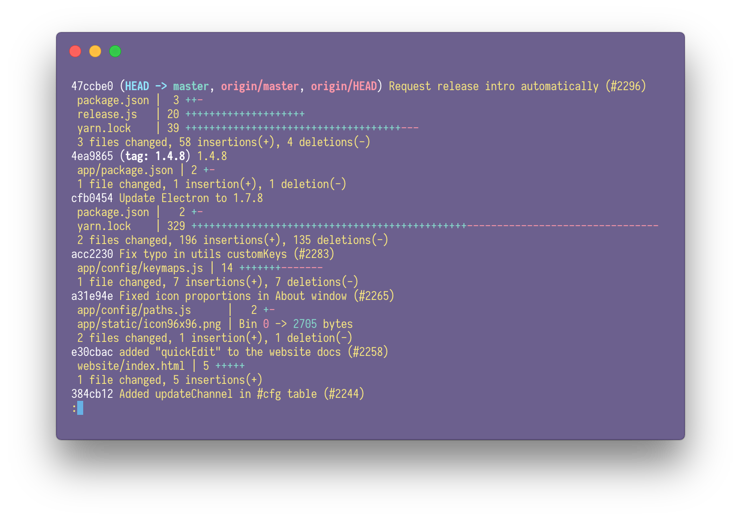

# hyper-a-grim-parody-of-a-video-game

🦄 A grim parody of a video game theme for [hyper](https://hyper.is)—ported from [@notwaldorf](https://github.com/notwaldorf) [tufte iTerm theme](https://github.com/notwaldorf/.not-quite-dotfiles/blob/master/terminal-preferences/tufte.itermcolors).



## Install

Edit *~/.hyper.js* and add **hyper-a-grim-parody-of-a-video-game** to the plugins list.

```
plugins: [
  "hyper-a-grim-parody-of-a-video-game"
]
```

## License

[MIT](./LICENSE)
